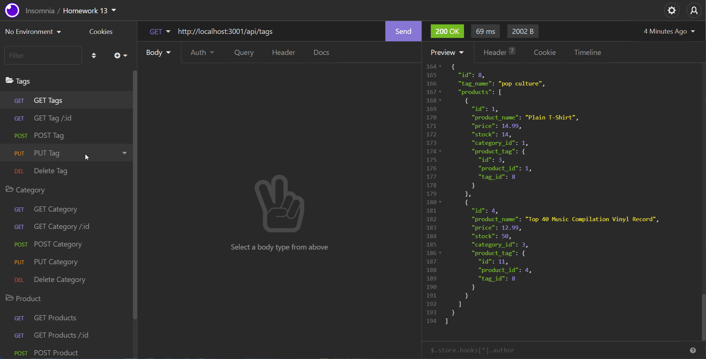

# E-Commerce-Back-End

## Description

This project aims to use MYSQL along with Sequelize in order to make a back-end database that could be edited through the use of routes and APIs.

## [Try it yourself!](https://github.com/JaggedComet/E-Commerce-Back-End.git)



## Installation

First git clone this project repository on github, then you would need to run ```npm i``` to install the nessessary files. You would also need to login to mysql in order to run the schema, and before you can do that, you would need to make an ```.env``` file in order to put your credentials in. After that, you would run ```node seeds``` in order to seed the project, then install a framework that lets you test APIs, like [Insomnia](https://insomnia.rest/download). Then you would test the server on that framework by using ```npm start``` or ```node server``` on the commandline. 


## Usage

To use the application, you would need to run ```npm i``` on the commandline in order to get the necessary files. After that you would run ```.env.EXAMPLE .env``` then replace the ```.env``` file's information with your own. Then you would run MYSQL on the commandline and source the schema with ```mysql -u root -p < db/schema.sql;``` in order to source the schema, then you would type ```quit``` to leave. After that, you would run ```node seeds``` in order to seed that database, then you would run ```node server.js``` to run the server on your local host. After that you would open your 3rd party framework, like Insomnia and test the application on it by using GET/POST/PUT/PULL/DELETE.

## Technology

- JavaScript<br>
- NodeJS<br>
- MySQL2<br>
- Sequelize<br>
- Dotenv<br>
- Express

## Credits

I'd like to thank David Luu for helping me test some solutions and code in this project: <br>
- Github: [David Luu](https://github.com/MaestroLuu) 


## Questions

If you need to reach out, here are ways you can:<br />
Github: https://github.com/JaggedComet<br>
Email: MarcoFlores1029@gmail.com